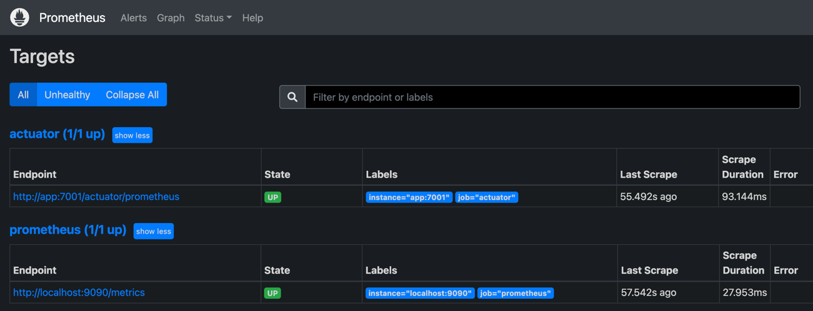
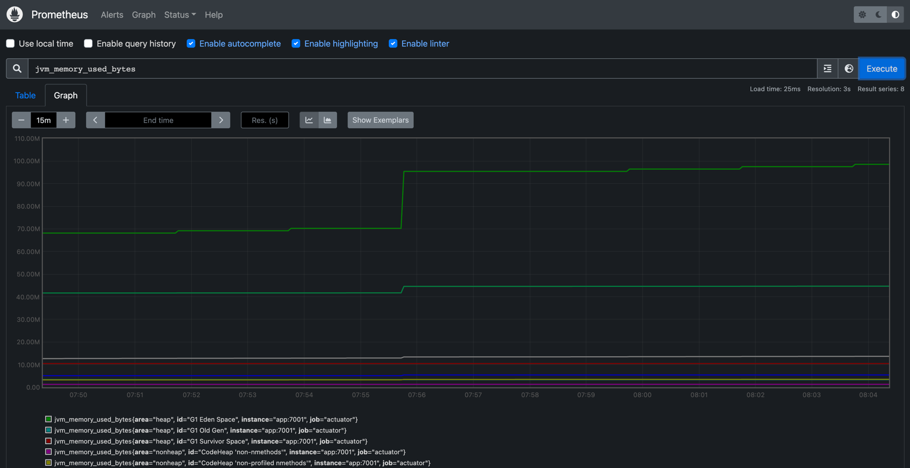
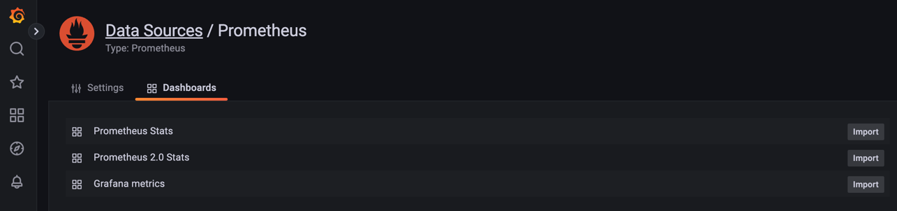

# 執行程式

1. 啟動 docker
   
   - 服務包含了 sprint boot web app (只有 actuator 功能)、Prometheus、Grafana

     ```bash
     $ docker-compose up
     ```

2. 連線到 Prometheus
   - Targets: http://localhost:9090/targets
     - 因為在 prometheus/prometheus.yml 中 target 有設定 app:7001，所以在 Targets 清單中會看到相對應的 url。
     
   - Graph: http://localhost:9090/graph
     - 可以在 Search bar 中輸入 Expression 像是 「_jvm_memory_used_bytes_」然後點擊 Execute 產生圖表
       

3. 連線到 Grafana

    - 至 http://localhost:3000/plugins/prometheus 新增 Prometheus 的 plugin，在 URL 中輸入 「http://prometheus:9090」，然後點擊 「Save & test」按鈕。
    - 新增的 data source 可以新增 Dashboard
      

# 參考

1. [Spring Boot Actuator](https://www.baeldung.com/spring-boot-actuators)
2. [SpringBoot 如何加入 Prometheus & Grafana 監控](http://samchu.logdown.com/posts/7805002-springboot-how-to-join-prometheus-and-grafana-monitoring)