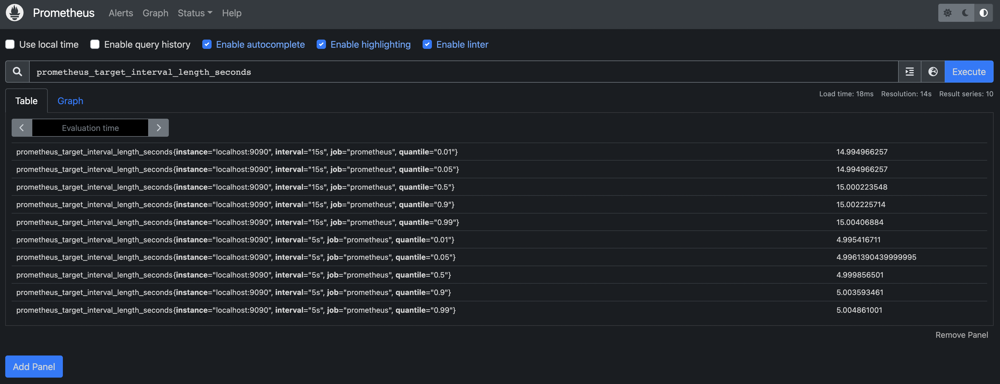

# 執行程式

1. 啟動 docker
   
   - 服務包含了 sprint boot web app (只有 actuator 功能)、Prometheus、Grafana

     ```bash
     $ docker-compose up --build --force-recreate -d
     ```

2. 連線到 Prometheus
   - Targets: http://localhost:9090/targets
     - 因為在 prometheus/prometheus.yml 中 target 有設定 app:8080，所以在 Targets 清單中會看到相對應的 url。
     
   - Graph: http://localhost:9090/graph
     - 範例一: Graph 分頁中，在 Search bar 中輸入 Expression 像是 「_jvm_memory_used_bytes_」然後點擊 Execute 產生圖表，可以查看 JVM 記憶體隨著時間變化的使用量
       
     - 範例二: Table 分頁中，輸入「_prometheus_target_interval_length_seconds_」查看每次抓取 target metrics 的時間間隔。
       
       - 如同 prometheus.yml 中設定的，localhost:9090 每 5 秒會爬取一次資料；app:8080 每 15 秒會爬取一次資料。因為 prometheus 不會恰恰在這兩個時間點爬取資料，所以可以看到結果顯示的誤差。
       - quantile 是分位數，可以藉此知道數據的分佈。例如: quantile = 0.5 為中位數。
       - 更進一步，如果只想看 quantile = 0.5 的結果，可以輸入「_prometheus_target_interval_length_seconds{quantile="0.5"}_」。
       - 或者，也有函式可以使用，例如 count 可以得到結果的總筆數，而「_count(prometheus_target_interval_length_seconds)_」將回傳 10 (見範例一的結果，有 10 筆資料)。
     - 範例三: Graph 分頁中，輸入「_rate(prometheus_tsdb_head_chunks_created_total[1m])_」
     - 查詢語法參考 [Querying Prometheus](https://prometheus.io/docs/prometheus/2.38/querying/basics/)

3. 連線到 Grafana

    - 至 http://localhost:3000/plugins/prometheus 新增 Prometheus 的 plugin，在 URL 中輸入 「http://prometheus:9090」，然後點擊 「Save & test」按鈕。
    - 新增的 data source 可以新增 Dashboard
      

# 參考

1. [Spring Boot Actuator](https://www.baeldung.com/spring-boot-actuators)
2. [SpringBoot 如何加入 Prometheus & Grafana 監控](http://samchu.logdown.com/posts/7805002-springboot-how-to-join-prometheus-and-grafana-monitoring)
3. [Prometheus: Getting Started](https://prometheus.io/docs/prometheus/latest/getting_started/)